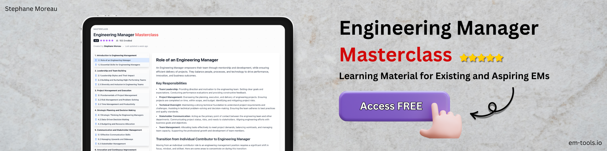

# Senior Engineering Manager

### Access my [Free EM Masterclass](https://www.em-tools.io/en/em-masterclass) 🌟

     
     
     

### I skipped uni to chase my dream in London - and it was the best decision I ever made.

Here’s what happened:

<strong>2016</strong>: Dropped out of university in Greece and moved to London with no degree, no connections, but a dream - to work as a software engineer. Landed my first software engineering job within 1 month.

<strong>2019</strong>: Was offered an Engineering Manager role at a leading Cyber Security company. Led a team that developed solutions protecting millions of users from cyber threats.

<strong>2022</strong>: Advanced to a Senior EM / Head of Engineering role at a high growth startup, overseeing 4 global teams (20+ engineers) managing 25 open-source libraries. Improved innovation and enhanced cross-functional collaboration across the company.

<strong>2024</strong> & Beyond: Founded [EM Tools](https://www.em-tools.io) to empower engineers to confidently transition into leadership roles. My mission is to provide the resources I wish I had when I started: an [EM Masterclass](https://www.em-tools.io/en/em-masterclass), [templates for Engineering Managers](https://www.em-tools.io/en/em-templates), career frameworks for [ICs](https://www.em-tools.io/en/career-framework/ic) and [EMs](https://www.em-tools.io/en/career-framework/em), and more.

If you’re ready to accelerate your journey I offer:

- 🌟 [Free Engineering Manager Masterclass](https://www.em-tools.io/en/em-masterclass)
- 🎯 [EM Templates & Playbooks](https://www.em-tools.io/en/em-templates)
- 📈 Career Frameworks for [ICs](https://www.em-tools.io/en/career-framework/ic) & [EMs](https://www.em-tools.io/en/career-framework/em)
- 🚀 [12-Week Leadership Accelerator](https://www.em-tools.io/en/leadership-accelerator)

→ https://www.em-tools.io

Always looking to connect with engineers and future leaders. Let’s make your journey remarkable!

---

As a Senior Engineering Manager, I specialize in leading cross-functional teams, aligning technology with business strategy, and fostering a culture of innovation and growth.

My focus is on creating high-performance teams fueled by passion, openness, and transparency.

---

Certified Lean Six Sigma Black Belt, ScrumMaster, Azure Databricks Architect, and AWS Cloud & AI Practitioner.

<!-- Aside from my professional endeavors, I'm pursuing a part-time [MSc in Technology Management](https://www.open.ac.uk/postgraduate/qualifications/f36) and I aspire to become decent at creating [ YouTube content](https://www.youtube.com/@st.moreau?sub_confirmation=1). -->

<!-- github stats -->
<!--

 -->

---

### 📺 Latest YouTube Videos

<!-- BEGIN YOUTUBE-CARDS -->

<!-- END YOUTUBE-CARDS -->

