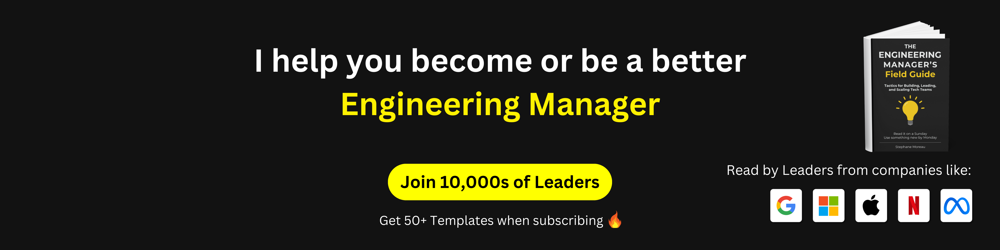

## Senior Engineering Manager <a href="https://github.com/ably">@Ably</a>

Driving Technological Vision & Strategy | Championing EQ in Leadership

     
     
     

---

### 📺 Latest YouTube Videos

<!-- BEGIN YOUTUBE-CARDS -->

<!-- END YOUTUBE-CARDS -->

